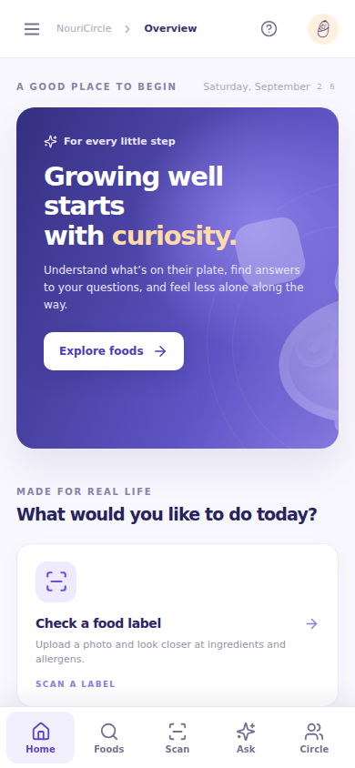
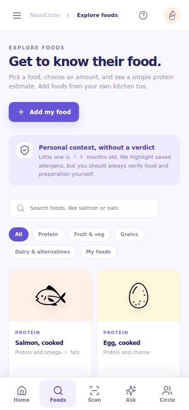
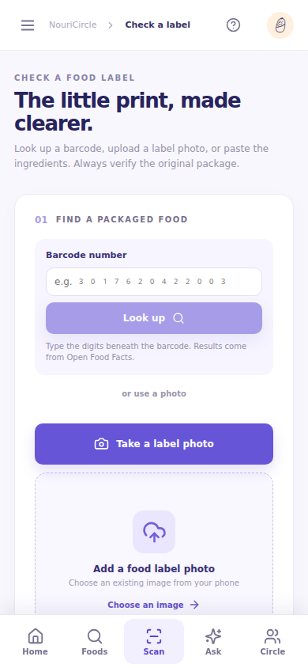
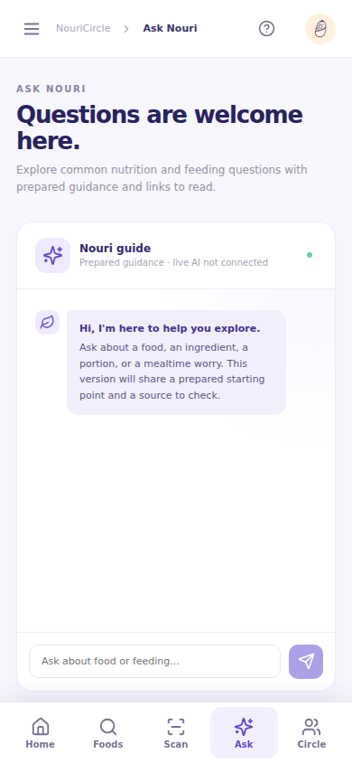

# NouriCircle

NouriCircle is a web and mobile prototype for parents and caregivers exploring food with young children. It puts food ideas, a simple meal log, packaged food label checks, feeding questions, and parent conversations in one place. The Android app uses the phone camera to photograph a food label; the website offers a photo upload. Both use the same React interface.

**Try it:** [Open the website](https://fredericsetievi.github.io/AIID-NouriCircle/) · [Download the Android test APK](mobile/downloads/NouriCircle-Android-debug.apk) · [Read the feature guide](docs/FEATURES.md)


*Concept poster from the project folder. The app screenshots below show the current prototype.*

## What parents can do

The **home screen** gives a starting point for the day. Parents can move directly to food ideas, label checks, questions, and the parent circle without searching through separate tools.

The **food explorer** helps a parent look up a food and estimate the protein in a chosen portion. It includes 20 example foods and lets parents save their own foods. This can make meal planning and recall easier, while keeping the numbers visibly approximate.

| Home | Explore foods |
| --- | --- |
|  |  |

The **label checker** helps with small print on packaged food. A parent can take or upload a label photo, correct the extracted text, and review highlighted allergy and ingredient terms. They can also type a barcode number to look up a public Open Food Facts record. The original package is the reference for allergy decisions; the app does not declare a product safe.

**Ask Nouri** gives parents a place to start with common feeding and nutrition questions. The public demo currently shows prepared guidance with reading links. A separate, privately configured Worker can enable live Gemini answers; the app labels which mode is active.

| Check a label | Ask Nouri |
| --- | --- |
|  |  |

Parents can also create a **child profile** with an age and known allergies, record foods in **today's meal log**, and review an estimated protein total. The **parent circle** displays sample conversations and lets a parent add posts and replies on their own device. These entries stay on that device; the circle is a demonstration, not a shared live forum.

This is an educational prototype for learning and exploration. It does not diagnose allergies, prescribe a diet, or replace care from a clinician.

## Project layout

| Path | Purpose |
| --- | --- |
| `web/` | Shared React app, public configuration, and optional Ask Nouri Worker |
| `mobile/android/`, `mobile/ios/` | Native Capacitor projects for phones |
| `mobile/downloads/` | Latest Android debug APK published by the mobile workflow |
| `docs/images/` | Screenshots captured from the current mobile-sized app interface |
| `scripts/`, root configuration | Build both platforms from the shared source |
| `index.html`, `assets/`, `ask-config.json` | Generated website copy for the current GitHub Pages branch setup |

## Run it

```bash
npm install
npm run dev
```

Open `/app.html` on the local URL printed by Vite. The app source is in `web/`; native projects are in `mobile/`. To check a production build, run `npm run build` and `npm run preview`. This repository's Pages setting currently serves `main` at the repository root. After editing source files, run `npm run sync-pages` and commit the updated `index.html` and `assets/` with the source. The GitHub Actions workflow also builds a `dist/` deployment for a future switch to Actions based Pages hosting.

For a feature-by-feature description, including the problem each feature addresses, see [Feature documentation](docs/FEATURES.md). A five-step getting started guide appears on the first visit and can be reopened from the help icon or menu.

## Install the website on a phone

The GitHub Pages site is also an installable progressive web app. On Android, open [NouriCircle](https://fredericsetievi.github.io/AIID-NouriCircle/) in Chrome, tap the three-dot menu, then choose **Install app** or **Add to Home screen**. On iPhone, open it in Safari, tap **Share**, then **Add to Home Screen**. Launch the icon for an app-like window without an address bar. The first visit needs internet. Some previously opened screens can work offline, but food lookups, OCR downloads, and future live Gemini answers need internet. Saved entries remain on the device and do not sync.

The manifest, icons, and service worker are built into `dist/` and copied to the Pages repository root by `npm run sync-pages`.

## Important limits

This is an educational prototype, not medical advice. Food values are rounded illustrative estimates per 100 g. Brands and preparation differ. OCR can miss or misread text. Check the original food package and your child's allergy care plan. Consult a clinician for individual nutrition, allergy, growth, or health questions. Live AI answers can be inaccurate and do not include live source verification. Live accounts, moderation, data sync, and a verified nutrition database are future work.

No image, child profile, post, or meal log is sent to a NouriCircle server. A barcode lookup sends the barcode to Open Food Facts and receives a public product record. When live Ask Nouri is enabled, the question, recent chat, and any food estimate directly relevant to the question go through the Worker to Gemini. Profile, custom food, meal, and local forum data are stored in the current browser. This is not a synced account: another device or browser will not show the saved entries. OCR runs in the browser through Tesseract.js, which loads its worker and language assets on first use. Clear this site's browser storage to reset the demo.

## Sources used for the educational copy

- [CDC: Introducing solid foods](https://www.cdc.gov/infant-toddler-nutrition/foods-and-drinks/when-what-and-how-to-introduce-solid-foods.html)
- [CDC: Foods and drinks to encourage](https://www.cdc.gov/infant-toddler-nutrition/foods-and-drinks/foods-and-drinks-to-encourage.html)
- [CDC: Choking hazards](https://www.cdc.gov/infant-toddler-nutrition/foods-and-drinks/choking-hazards.html)
- [AAP: Picky eating](https://www.healthychildren.org/English/ages-stages/toddler/nutrition/Pages/Picky-Eaters.aspx)
- [USDA FoodData Central](https://fdc.nal.usda.gov/)
- [Open Food Facts API and reuse rules](https://openfoodfacts.github.io/documentation/docs/Product-Opener/api/)

## Technical notes

React, TypeScript, Vite, Lucide icons, and Tesseract.js. There is no backend and no secret in the client. The Vite build uses relative asset paths so the static output can be hosted under a repository subpath.

The barcode lookup uses Open Food Facts' currently supported v2 product endpoint because it returns explicit per-100 g nutriment fields. New integrations should plan to migrate to v3. The public API asks applications to identify themselves with a custom User-Agent; browsers do not allow JavaScript to set that header. For a larger public release, route lookups through a small backend, identify the app, cache responses, and honor the API's rate limits and attribution requirements. The current direct browser lookup may be affected by cross-origin rules or API policy changes.

USDA FoodData Central is **not** connected in this static release. The fresh food examples remain educational prototype content.

## Activate live Ask Nouri

The static GitHub Pages site cannot protect an API key. The `web/worker/` directory contains a small Cloudflare Worker that calls Gemini 3.5 Flash-Lite on the server. Cloudflare Workers and Gemini both have free tiers, with quotas and eligibility that can change. You need a Cloudflare account and a Gemini API key from [Google AI Studio](https://aistudio.google.com/app/apikey). Never put the key in a GitHub file, Pages variable, or browser input.

1. From the repository root, deploy the Worker with `npx wrangler deploy --config web/worker/wrangler.toml`. Sign in to your own Cloudflare account if prompted. Note the resulting `https://...workers.dev` URL.
2. Store the key as a Worker secret with `npx wrangler secret put GEMINI_API_KEY --config web/worker/wrangler.toml`. Enter it at the secure CLI prompt, not in a command argument or GitHub commit.
3. Set `web/public/ask-config.json` to `{ "endpoint": "https://your-worker.workers.dev" }`, run `npm run sync-pages`, and commit and push `web/public/ask-config.json`, `ask-config.json`, and the built site files. The URL is public; it contains no key.
4. Open Ask Nouri. Its header should say “Live AI · Gemini Flash-Lite”. Ask a test question and verify an answer. If the request fails, the chat shows a visible error rather than calling a prepared answer “live”.

The Worker accepts the website origin `https://fredericsetievi.github.io` and the two configured Capacitor app origins, limits input and output sizes, and does not receive the saved child profile or meal log. Its public endpoint can still consume quota if abused by a non-browser client, so add provider rate limits and monitoring before a larger public launch. Gemini's free tier may use submitted prompts to improve Google's products. Ask users not to include names or private health details. Questions and recent chat text are sent to Gemini only when the Worker is configured.

## Mobile app (Android and iOS)

The Capacitor projects in `mobile/android/` and `mobile/ios/` use the same React app and local storage as the website. On a phone, the bottom tabs lead to Foods and Scan. Scan can open the native camera, read label text on device, or look up a typed barcode through Open Food Facts. A photo of an unlabelled meal cannot identify its ingredients or nutrients; search its component foods instead. The camera photo is held only for the current review and is not uploaded by NouriCircle. Each installation stores its own child profile and meal log, with no account sync.

Requirements: Node.js, Android Studio with an Android SDK for Android, or a Mac with Xcode for iOS. From this repository:

```sh
npm ci
npm run mobile:sync
npm run mobile:android  # or: npm run mobile:ios on a Mac
```

Run the app in a simulator or on a device from Android Studio/Xcode. After changing web code, run `npm run mobile:sync` again before building. Camera and photo library permission prompts appear when used. Internet access is needed for first-use OCR language downloads, barcode lookup, and optional live Ask Nouri. Prepared Ask guidance and the bundled food examples work without an AI endpoint. To enable live Ask in mobile, configure `web/public/ask-config.json` with your deployed HTTPS Worker URL, sync again, and deploy the updated `web/worker/` code to allow the exact Capacitor origins. Keep the Gemini key in the Worker secret.

The repository includes a debug Android APK for testing. App store signing, testing on physical devices, policy review, and release setup are still needed for distribution. No installable iPhone build is published.

### Download mobile builds

Download [NouriCircle-Android-debug.apk](mobile/downloads/NouriCircle-Android-debug.apk) from GitHub by opening the file and choosing **Download raw file**. You can also download the `nouricircle-android-debug-apk` artifact from **Actions → Mobile builds** and unzip it. Transfer the APK to your Android phone, open it, and allow installation from that file manager or browser if Android asks. The workflow replaces the file in `mobile/downloads/` after a successful Android build. This is a test build signed with a generated debug key; a Play Store release needs its own signing and distribution setup. Each Actions run can use a different debug signing key, so uninstalling a previous test build may be necessary before installing a new one.


The same **Mobile builds** workflow also creates `nouricircle-ios-simulator-app`, a zipped `.app` for an iOS Simulator on a Mac. It cannot be installed on a physical iPhone. A device-installable `.ipa` requires an Apple signing certificate and provisioning profile (or TestFlight distribution), which are not configured in this repository. Never commit signing credentials.
